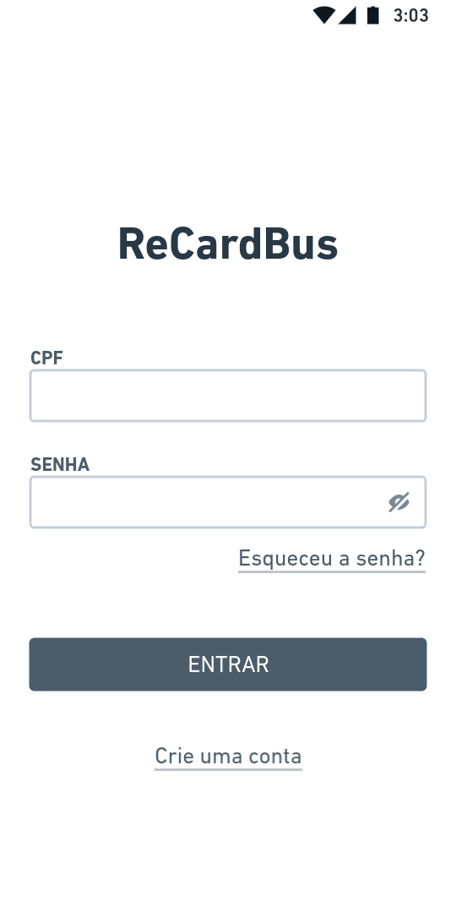
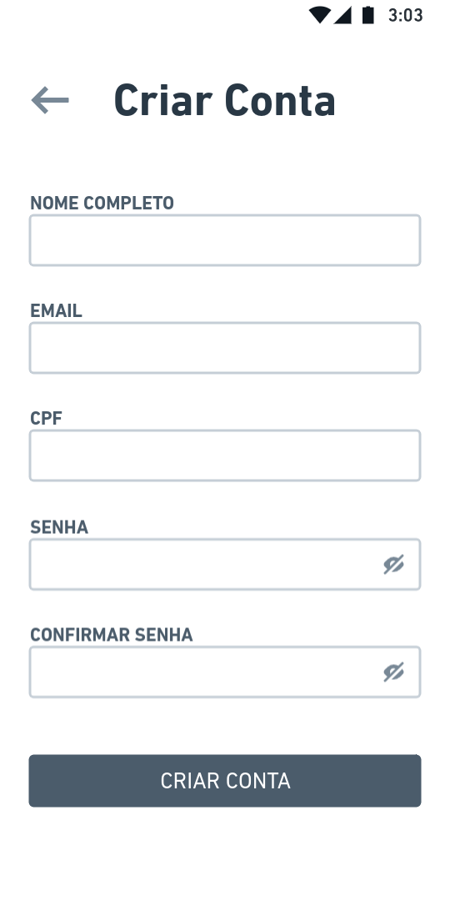
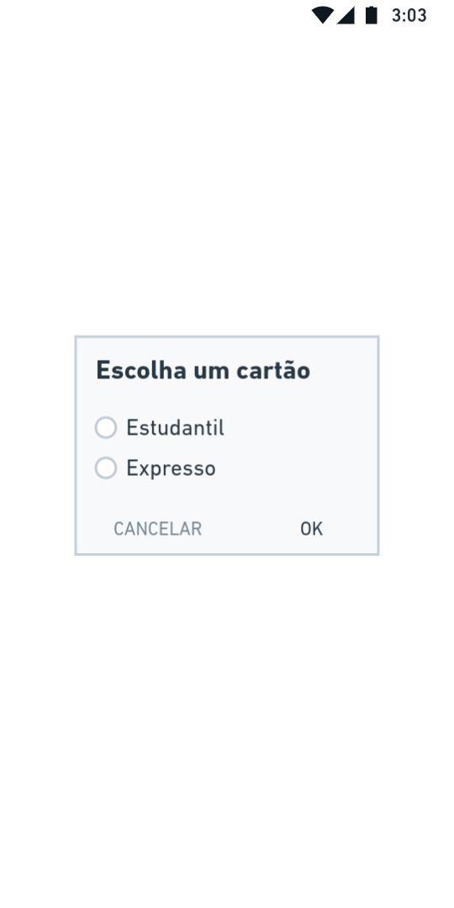
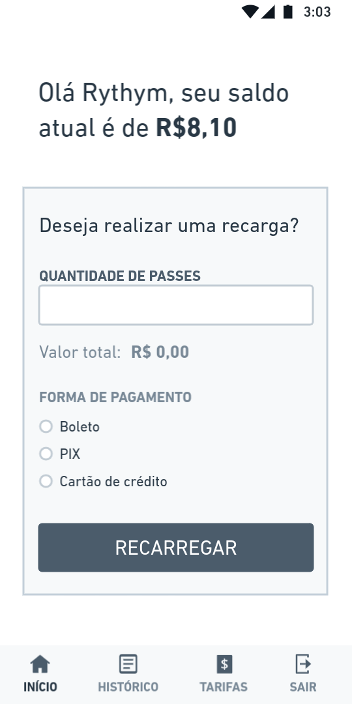
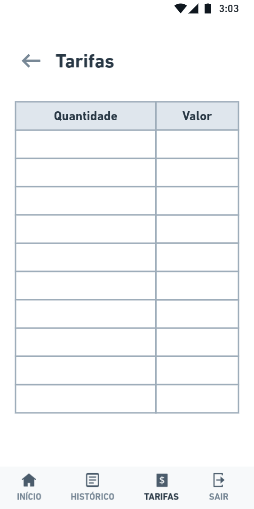
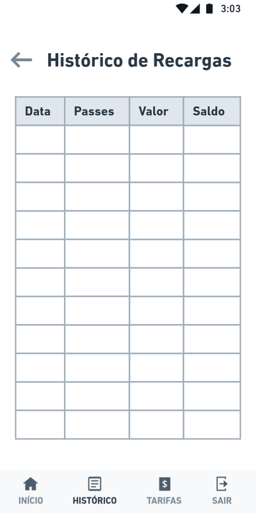

# ReCardBus

## Equipe
- Marcos Vinícius Macedo de Menezes
- Tiago Batista de Sousa Benvindo

## Tema
- ReCardBus - é uma aplicação para realizar a recarga de passes na carteira de ônibus coletivo do munícipio de Teresina

## Tecnologias
- Análise e Projeto de Sistemas - Elaboração dos diagramas em UML (Diagramas de caso de uso, de classes e de atividades)
- Engenharia de Software III - Metodologia ágil (SCRUM)
- Programação para Internet II - React e Node

## Funcionalidades

| Funcionalidade  |  Descrição  |  Tela  |
| ------------------- | ------------------- | ------------------- | 
|  Fazer login |  O sistema deve permitir que o usuário faça a autenticação |  |
|  Cadastrar usuário |  O sistema deve permitir que o usuário seja cadastrado |  |
|  Escolher cartão |  O sistema deve permitir que o usuário escolha um cartão caso possua mais de um |  |
|  Recarregar cartão |  O sistema deve permitir que o usuário realize a recarga do seu cartão |  |
| Escolher forma de pagamento | O sistema deve permitir que o usuário escolha uma forma de pagamento | Obs: Mesma tela de recarregar cartão |
| Visualizar saldo | O sistema deve informar o saldo atual do cartão | Obs: Mesma tela de recarregar cartão |
| Visualizar tarifas | O sistema deve exibir a tabela de Tarifas de acordo com a categoria do cartão |  |
| Visualizar histórico de recargas | O sistema deve exibir o histórico de recargas realizadas |  |
| Calcular o valor total da recarga | O sistema deve calcular o valor o total a ser pago para realizar a recarga | Obs: Mesma tela de recarregar cartão |
| Fazer logout | O sistema deve permitir que o usuário faça logout | Obs: Está no Tab bar |
